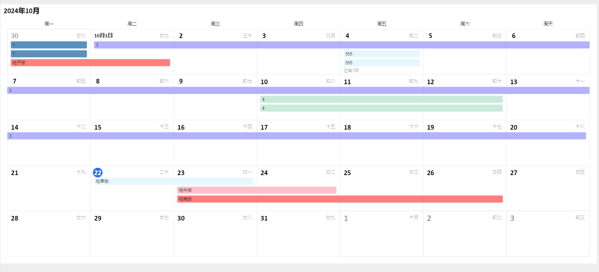

# konva-calendar
A calendar for managing the progress of tasks

### Usage
``` typescript
import { CanvasKonvaCalendar } from 'konva-calendar'
const element = document.getElementsByClassName('.calendar-root')[0]!;
    const bootstrap = new CanvasKonvaCalendar({ 
      mode: 'edit', 
      container: '.smart-table-root',
      width : element.clientWidth || innerWidth - 240
     })
    
    bootstrap.setData([
    {
       startTime: '2024-10-01',
       endTime: '2024-10-20',
       fill: 'rgba(0, 0, 255, 0.3)',
       description: '3 ',
       id: uuid()
     },
    ])
    bootstrap.on('ADDTASKRANGE', (day: string) => {
      console.log('添加任务', day);
    })
    bootstrap.on('CLICKRANGE', (day: string) => {
      console.log('选择日期', day);
    })
    bootstrap.on('CONTEXTMENU', (day: string) => {
      console.log('右键', day);
    })
    bootstrap.on('UPDATETASK', (source: any) => {
      console.log('任务更新', source);
    })
    bootstrap.on('CLICKSURPASSTIP', (day: string) => {
      console.log('查看所有选项', day);
    })
```
### preview
